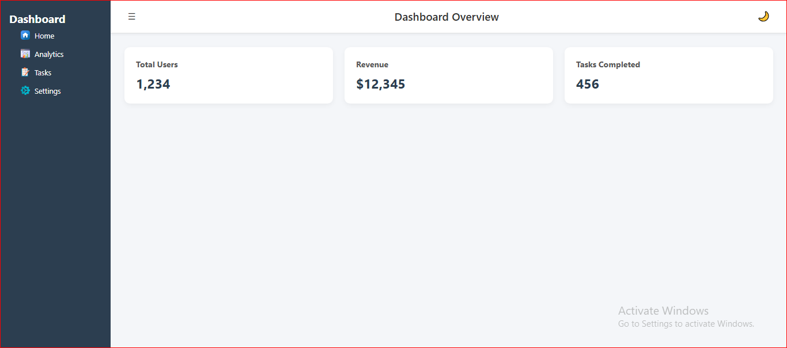

# Day 1: Responsive Dashboard UI (Static)

## ✅ Task Completed
- Built a fully responsive dashboard using HTML & CSS
- Sidebar with collapse functionality
- Top navbar for branding/user profile
- 3 main widgets showing:
  - Total Users
  - Revenue
  - Tasks Completed
- Added dummy content to each widget
- Bonus: Implemented Dark Mode toggle using JavaScript

## 🛠️ Technologies Used
- HTML5
- CSS3 (Flexbox + Grid)
- Vanilla JavaScript (for dark mode toggle)

## 📸 Screenshots

## 🔍 Notes
- Learned to combine Flexbox and Grid effectively
- Dark mode toggle managed using class switching
- Layout adapts to mobile, tablet, and desktop widths
