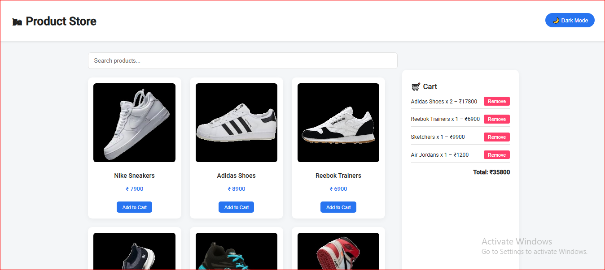

# ✅ Day 6 – React Mini Project: Product List with Cart

## 📌 Project Overview
- Built a responsive product listing page using **React**
- Integrated a **Cart** with add/remove functionality
- Implemented **Dark/Light mode toggle**
- Used **custom images** with uniform sizing
- Responsive UI with a **Flipkart-style** theme
- Mobile-friendly cart with **floating toggle button**

---

## ✅ Features Implemented

- [x] Product List with image, name, price
- [x] Add to Cart button
- [x] Cart section with item summary and total
- [x] Remove from Cart functionality
- [x] Dark/Light mode switch
- [x] Responsive grid layout (Flex/Grid)
- [x] Fixed image sizing using CSS
- [x] Mobile Cart Drawer (floating button)

---

## 🧠 Learnings

- React useState/useEffect for global UI control
- CSS tricks: `object-fit`, transitions, and mobile media queries
- React component modularity for scalability
- Mobile UX enhancements like cart drawer

---

## 📸 Screenshots

>
---

## 🔗 GitHub Repository

> [[GitHub repo link here](https://github.com/Aniket-hola9/Mini-Projects.git)]

---

